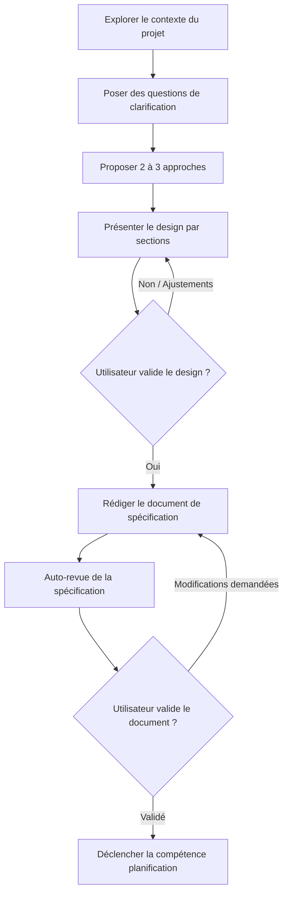

# Brainstorming et Conception d'Architecture

La compétence `brainstorming` transforme des idées brutes ou des demandes utilisateur en spécifications et designs d'architecture complets grâce à un dialogue collaboratif et structuré.

> [!CAUTION]
> **VERROU ABSOLU (HARD-GATE)** : N'exécutez AUCUNE compétence d'implémentation, n'écrivez AUCUN code et ne créez AUCUN fichier de code source tant que le design n'a pas été formellement présenté et validé par l'utilisateur. Cela s'applique à TOUS les projets, même ceux perçus comme "très simples".

---

## Anti-Pattern : "C'est trop simple pour nécessiter un design"

Chaque projet doit suivre ce processus. Un script à fonction unique, une liste de tâches, une modification de configuration — tous sans exception. Les projets "simples" sont précisément ceux où les fausses hypothèses non vérifiées entraînent le plus de travail inutile. Le document de design peut être court pour un projet simple, mais il doit OBLIGATOIREMENT être présenté et approuvé par l'utilisateur.

---

## Liste de Contrôle (Workflow Général)

L'agent doit suivre les étapes suivantes dans l'ordre :

1. **Explorer le contexte du projet** — Examiner les fichiers existants, la documentation et les commits récents.
2. **Poser des questions de clarification** — Poser **une seule question à la fois**, pour comprendre l'objectif, les contraintes et les critères de succès.
3. **Proposer 2 à 3 approches** — Présenter différentes options avec leurs avantages/inconvénients et fournir une recommandation motivée.
4. **Présenter le design par sections** — Structurer la proposition par sections adaptées à la complexité et obtenir l'accord de l'utilisateur après chaque section.
5. **Rédiger le document de spécification** — Enregistrer la spécification validée dans `docs/specs/YYYY-MM-DD-<sujet>-design.md` et effectuer un commit Git.
6. **Auto-revue de la spécification** — Vérification interne de la complétude, de la cohérence et de l'absence de placeholders.
7. **Revue de la spécification par l'utilisateur** — Demander à l'utilisateur de valider le document rédigé.
8. **Transition vers la planification** — Déclencher la compétence `planification` pour élaborer le plan d'implémentation.

---

## Flux du Processus (Diagramme)

---

## Guide Détaillé de l'Étape de Conception

### 1. Comprendre l'idée et évaluer la portée
- **Analyser l'existant** : Inspecter le code et la structure avant de poser des questions sur des éléments déjà en place.
- **Découpage préalable** : Si la demande englobe plusieurs sous-systèmes indépendants (ex: "Créer une plateforme avec chat, stockage, facturation et analytics"), le signaler immédiatement et aider l'utilisateur à découper en sous-projets autonomes.
- **Questions ciblées** : Poser **une seule question par message**. Préférer les questions à choix multiples lorsque c'est pertinent.

### 2. Proposer des approches et appliquer YAGNI
- Présenter 2 à 3 approches techniques distinctes.
- Exposer clairement les compromis (facilité de maintenance, performance, complexité).
- Recommander la solution la plus adaptée et appliquer rigoureusement le principe **YAGNI** (*You Aren't Gonna Need It*) : éliminer les fonctionnalités superflues.

### 3. Présenter le design
- Présenter l'architecture, la structure des modules, les flux de données, la gestion des erreurs et la stratégie de test.
- Veiller à l'isolement des modules : chaque unité doit avoir une responsabilité unique et des interfaces claires.

### 4. Rédiger et valider la Spécification
- Enregistrer le document sous `docs/specs/YYYY-MM-DD-<sujet>-design.md`.
- Réaliser l'auto-revue :
  - **Scan Anti-Placeholder** : Aucun "TODO", "TBD", ni exigence vague.
  - **Cohérence interne** : Aucune contradiction entre les sections.
  - **Clarté des exigences** : Aucune ambiguïté pouvant mener à une erreur d'implémentation.
- Présenter le document à l'utilisateur pour validation finale.

---

## Compagnon Visuel (Au Besoin)

Si une question gagne à être illustrée visuellement plutôt que décrite par texte (maquettes, diagrammes d'architecture complexes), vous pouvez proposer d'ouvrir un onglet de navigateur ou de générer un schéma Mermaid visuel.

---

## Arbre de Décision

- **La demande concerne-t-elle la création ou la modification de code/fonctionnalité ?**
  - **Oui** -> Appliquer OBLIGATOIREMENT cette compétence `brainstorming` avant tout code.
- **Le projet semble-t-il très simple (ex: modif 1 ligne) ?**
  - **Oui** -> Appliquer tout de même la compétence, mais produire un design très concis (quelques lignes).
- **Le design est-il approuvé par l'utilisateur ?**
  - **Oui** -> Enregistrer le document spec et basculer sur la compétence `planification`.
  - **Non** -> Réviser les sections rejetées et redemander validation.
