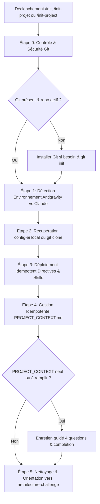

# Compétence : Initialisation de Projet (Standards & Compétences Config-AI)

## Description et Objectif
Cette compétence automatise de manière 100% autonome et **strictement idempotente** l'initialisation et la mise à niveau de tout environnement de projet selon l'architecture **Config-AI**. Elle garantit la présence préalable du contrôle de version Git, déploie les règles de gouvernance de l'agent (`GEMINI.md` ou `CLAUDE.md`), installe la suite de compétences expertes et guide le cadrage initial de l'architecture via `PROJECT_CONTEXT.md`.

---

## Commandes Déclencheuses (Triggers)
Cette compétence est invoquée directement via l'un des raccourcis suivants :
- `/init-projet`
- `/init-project`
- `/init`
- Expressions naturelles : *"Initialise ce projet"*, *"Configure mon environnement de travail"*, *"Mets en place config-ai"*.

---

## Quand utiliser cette compétence
- **Démarrage d'un nouveau projet** : Dès la création d'un nouveau dossier, pour poser immédiatement les fondations techniques.
- **Mise à niveau d'un projet existant** : Pour intégrer les standards de développement sans jamais écraser l'existant.
- **Vérification d'intégrité** : Pour s'assurer que le dépôt Git est actif, que les directives d'ingénierie sont en place et que les compétences sont à jour.

---

## Directives et Principes Fondamentaux

1. **Idempotence Universelle (Règle d'or)** :
   - L'opération peut être exécutée N fois d'affilée sans effet de bord destructif.
   - Ne **JAMAIS** écraser un fichier `PROJECT_CONTEXT.md`, `GEMINI.md` ou `CLAUDE.md` déjà existant ou personnalisé par le développeur.
   - Ne **JAMAIS** réinitialiser ou altérer un dépôt Git déjà existant.
   - Mettre à jour les compétences sans écraser ni supprimer les compétences tierces déjà installées.

2. **Filet de Sécurité Git Préalable (Règle Zéro)** :
   - Interdiction formelle d'écrire ou de modifier du code dans un projet non versionné sous Git.
   - Si Git est absent du système hôte, procéder à son installation silencieuse et autonome (via `winget`, `apt`, `brew` ou `choco`), puis rafraîchir la variable `PATH` dans la session courante.
   - Si le dossier de travail n'est pas un dépôt Git, exécuter immédiatement `git init`.

3. **Respect Strict de l'Environnement Cible** :
   - **Sous Google Antigravity** :
     - Déployer `GEMINI.md` à la racine du projet (si inexistant).
     - Déployer les compétences globales dans `~/.gemini/config/skills/` (sur Windows : `%USERPROFILE%\.gemini\config\skills`, sur Linux/macOS : `~/.gemini/config/skills`).
     - **Interdiction formelle** : Ne JAMAIS créer de dossier `.gemini/` à la racine du projet utilisateur (utiliser `.agents/skills/` si une portée locale au workspace est expressément requise).
   - **Sous Claude Code** :
     - Déployer `CLAUDE.md` à la racine du projet (si inexistant).
     - Déployer les compétences dans `.claude/skills/` à la racine du projet.

4. **Zéro Placeholder** :
   - Aucun commentaire `// TODO` ni code tronqué dans les fichiers configurés.

---

## Sources des Ressources `config-ai`

L'agent doit chercher les templates et les compétences dans l'ordre de priorité suivant :
1. **Source locale sur le poste (Développement)** : `c:\wamp64\www\dev\config-ai` (si existante et accessible).
2. **Dépôt distant officiel (Fallback universel)** : `https://github.com/tagcashdev/config-ai.git` (à cloner temporairement si la source locale n'est pas accessible).

---

## Procédure Pas à Pas (Workflow d'Exécution)



### Étape 0 : Contrôle et Filet de Sécurité Git
1. Exécuter un test de présence de Git :
   ```powershell
   git --version
   ```
2. Si Git n'est pas reconnu :
   - **Windows** : Tenter l'installation silencieuse sans intervention humaine :
     ```powershell
     winget install --id Git.Git -e --source winget --silent --accept-package-agreements --accept-source-agreements
     ```
     Puis rafraîchir le PATH en session :
     ```powershell
     $env:Path = [System.Environment]::GetEnvironmentVariable("Path", "Machine") + ";" + [System.Environment]::GetEnvironmentVariable("Path", "User")
     ```
   - **Linux** : `sudo apt-get update && sudo apt-get install -y git`
   - **macOS** : `brew install git`
3. Vérifier si le répertoire courant est un dépôt Git :
   ```bash
   git rev-parse --is-inside-work-tree
   ```
   - Si non ou erreur : exécuter `git init`.
   - Si déjà initialisé : ne pas réinitialiser (idempotence).

---

### Étape 1 : Détection de l'Environnement Hôte
Déterminer l'agent actif :
- **Google Antigravity** : Session active Antigravity IDE ou variable/config `~/.gemini`.
- **Claude Code** : CLI `claude` ou Claude Desktop.

---

### Étape 2 : Récupération des Ressources `config-ai`
1. Vérifier si `c:\wamp64\www\dev\config-ai` existe et est accessible.
2. Si inaccessible :
   ```bash
   git clone --depth 1 https://github.com/tagcashdev/config-ai.git .tmp-config-ai
   ```

---

### Étape 3 : Déploiement Idempotent des Directives & Compétences

#### A. Sous Google Antigravity :
1. **Directive projet `GEMINI.md`** :
   - Vérifier si `GEMINI.md` existe à la racine du projet.
   - Si absent : copier `templates/GEMINI.md` depuis `config-ai` vers la racine.
   - Si déjà présent : le conserver intact.
2. **Déploiement des compétences globales** :
   - Répertoire cible : `~/.gemini/config/skills/` (`C:\Users\<Utilisateur>\.gemini\config\skills\`).
   - Copier/mettre à jour les compétences de `config-ai/skills/*` :
     - `init-projet/`
     - `architecture-challenge/`
     - `brainstorming/`
     - `planification/`
     - `verif-code/`
     - `ui-ux-pro-max/`
     - `skill-finder/`

#### B. Sous Claude Code :
1. **Directive projet `CLAUDE.md`** :
   - Vérifier si `CLAUDE.md` existe à la racine du projet.
   - Si absent : copier `templates/CLAUDE.md` vers la racine.
   - Si déjà présent : le conserver intact.
2. **Déploiement des compétences du projet** :
   - Répertoire cible : `.claude/skills/` à la racine du projet.
   - Copier/synchroniser les compétences `config-ai/skills/*`.

---

### Étape 4 : Gestion et Renseignement Guidé de `PROJECT_CONTEXT.md`

1. **Vérification** :
   - Si `PROJECT_CONTEXT.md` n'existe pas : copier `templates/PROJECT_CONTEXT.md` vers la racine.
2. **Entretien interactif** :
   - Si `PROJECT_CONTEXT.md` est neuf ou contient des crochets `[...]`, poser les 3 questions fondamentales :
     - *1. Vision & Cible : Nom du projet, problème résolu et utilisateurs cibles ?*
     - *2. Cœur du MVP : Quelle est la fonctionnalité clé ?*
     - *3. Stack Technique : Technologies retenues (Frontend, Backend, DB, Auth, Services tiers) ?*
   - Remplir `PROJECT_CONTEXT.md` avec les réponses et demander validation à l'utilisateur.

---

### Étape 5 : Nettoyage & Prochaines Étapes
1. Supprimer le clone temporaire éventuel (`.tmp-config-ai`).
2. Afficher un récapitulatif clair :
   - ✅ Dépôt Git validé.
   - 📄 Directives (`GEMINI.md` / `CLAUDE.md`) en place.
   - 🧠 Compétences déployées et disponibles.
   - 📋 Contexte projet documenté.
3. Proposer la suite logique :
   - Audit technique : `/architecture-challenge`
   - Cadrage MVP / UX : `/brainstorming`
   - Feuille de route : `/planification`
