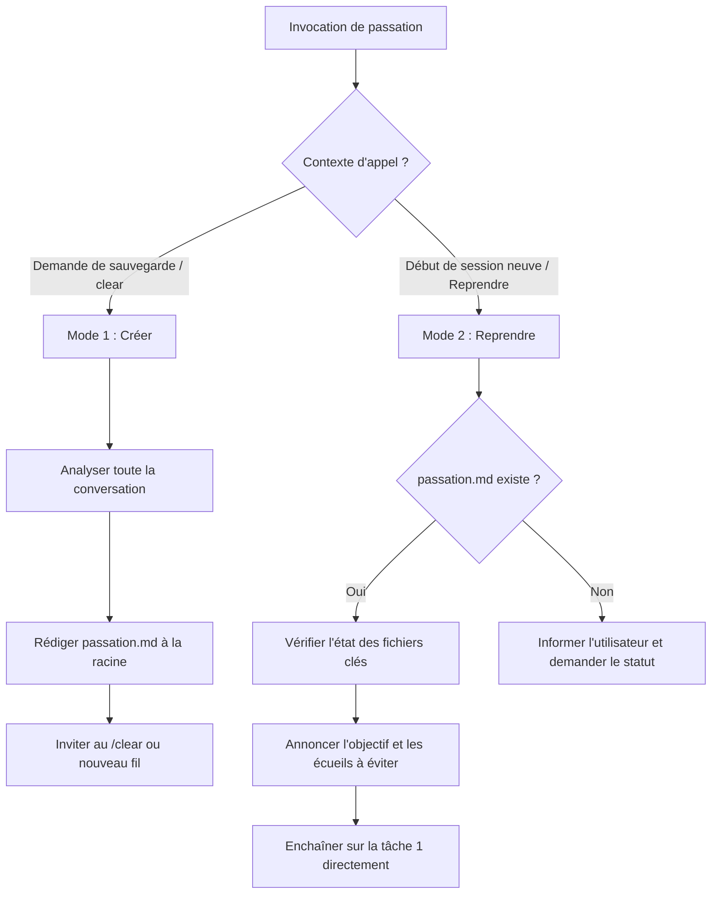

# Passation de Session

## Description et Objectif
Cette compétence permet de transférer le travail d'une session à la suivante sans perte de contexte, d'historique ni d'informations critiques. 
Au fil d'une session de développement, le contexte accumule du bruit (sorties volumineuses de terminal, tests infructueux, digressions). La passation extrait l'essence du travail accompli et des décisions prises pour permettre à une nouvelle session de redémarrer immédiatement avec une efficacité maximale, et **surtout sans réitérer les erreurs déjà commises**.

Elle fonctionne selon deux modes complémentaires :
- **Mode 1 : Créer** — Synthétiser et consigner l'état de la session courante dans `passation.md`.
- **Mode 2 : Reprendre** — Charger `passation.md` au démarrage d'une session pour reprendre le travail de façon fluide et autonome.

---

## Quand utiliser cette compétence
- **Pour créer une passation :**
  - L'utilisateur tape `/passation` ou demande explicitement *"fais une passation"*, *"sauvegarde le contexte"*, *"résume où on en est avant de clear"*.
  - La fenêtre de contexte devient saturée ou l'agent constate une baisse de vivacité due à la longueur des échanges.
  - L'utilisateur souhaite interrompre sa session de travail ou faire un `/clear` pour repartir sur une base propre.
- **Pour reprendre une passation :**
  - Une nouvelle session démarre avec un hook injectant le contenu de `passation.md`.
  - L'utilisateur indique *"reprends la passation"*, *"lis passation.md"*, *"on reprend où on en était"*.

---

## Directives et Bonnes Pratiques
1. **Intégrité et Vérité Factuelle** : Ne rien inventer. Si un élément n'a pas été abordé (ex. aucune tentative ratée), l'indiquer explicitement (*« Aucune tentative ratée à ce stade »*) plutôt que d'extrapoler.
2. **Valeur capitale des "Tentatives Ratées"** : Une session neuve n'a aucun moyen de deviner les impasses déjà explorées. Décrire précisément ce qui a été tenté, l'erreur exacte et la leçon retenue.
3. **Format Standardisé et Concis** : Le document `passation.md` doit pouvoir être lu et assimilé en moins de deux minutes. Préférer les chemins exacts de fichiers, les noms précis de fonctions et les messages d'erreur aux formulations vagues.
4. **Idempotence de la Sauvegarde** : Le fichier `passation.md` est toujours écrit à la racine du projet et remplace la version précédente. Seul l'état le plus récent est conservé.
5. **Autonomie lors de la Reprise** : Dès que `passation.md` est lu, annoncer l'objectif et la première étape, puis enchaîner directement sur l'exécution sans poser de question inutile sauf si un arbitrage utilisateur est requis.

---

## Procédure Pas à Pas / Workflow

### Mode 1 — Créer la passation

1. **Parcourir l'ensemble de la conversation :**
   - **L'objectif final** : Ce que l'utilisateur souhaite accomplir, formulé en 1 ou 2 phrases (mentionner l'évolution de l'objectif si le périmètre a changé).
   - **La problématique actuelle** : Blocage rencontré, message d'erreur précis, contraintes techniques et environnementales.
   - **Les fichiers importants** : Fichiers créés, modifiés ou à modifier impérativement pour la suite (avec leur rôle et statut exact).
   - **Les tentatives ratées (à ne pas reproduire)** : Ce qui a été testé, pourquoi cela a échoué (code d'erreur, incompatibilité, régression) et la conclusion tirée.
   - **Les prochaines étapes** : Liste ordonnée d'actions concrètes, la première devant être immédiatement actionnable.
   - **L'état exact au moment de la passation** : Où l'exécution s'est précisément arrêtée (ex. commande en cours, test qui échoue, décision d'architecture prise).

2. **Écrire le fichier `passation.md` :**
   - Écrire le fichier à la racine du projet (`passation.md`) en écrasant l'éventuelle version précédente.
   - Respecter scrupuleusement le gabarit fourni dans la section *Modèles et Exemples*.

3. **Passer la main à l'utilisateur :**
   - Conclure par un message clair invitant l'utilisateur à réinitialiser la session :
     > *« Passation enregistrée dans `passation.md`. Vous pouvez réinitialiser la session (ex: `/clear` sous Claude Code ou ouvrir un nouveau fil sous Antigravity). La nouvelle session chargera la passation et reprendra directement à l'étape : [Intitulé de la première prochaine étape]. »*

---

### Mode 2 — Reprendre le fil

1. **Lire le fichier `passation.md` :**
   - Si le fichier n'est pas déjà présent dans le contexte, le lire à la racine du projet.
   - S'il n'existe pas, signaler poliment son absence et demander à l'utilisateur quel est l'objectif en cours.

2. **Vérifier l'état réel des fichiers :**
   - Inspecter rapidement les fichiers listés comme "modifiés" ou "créés" pour vérifier que l'espace de travail est conforme à la description.

3. **Annoncer la reprise de façon synthétique :**
   - Résumer en 2-3 lignes : l'objectif compris, les pièges/tentatives ratées identifiés qu'il faudra éviter, et la première tâche qui va être exécutée.

4. **Exécuter la première étape :**
   - Démarrer directement l'implémentation de la première étape sans attendre d'approbation préalable, sauf si l'action comporte un risque destructif ou nécessite une réponse explicite de l'utilisateur.
   - Traiter la section *« Tentatives ratées »* comme une contrainte stricte : interdiction de relancer une approche ayant déjà échoué sans justification technique nouvelle.

---

## Modèles et Exemples

### Gabarit officiel pour `passation.md`

```markdown
# Passation — [Titre court du travail ou de la fonctionnalité]

_Créée le [Date et Heure]_

## 1. Objectif
[1 à 2 phrases résumant le résultat final attendu]

## 2. Problématique
[Symptôme, message d'erreur exact, contraintes techniques]

## 3. Fichiers importants
| Fichier | Rôle | État |
|---|---|---|
| `chemin/vers/fichier.ext` | Description du rôle | `modifié` / `créé` / `à modifier` / `référence` |

## 4. Tentatives ratées (à ne pas refaire)
- **[Approche tentée]** → [Résultat / Message d'erreur]. _Leçon retenue :_ [Pourquoi éviter cette approche].

## 5. Prochaines étapes
1. [Première action concrète et immédiatement actionnable]
2. [Étape suivante]
3. [Étape ultérieure]

## État exact au moment de la passation
[Où s'est arrêté le travail : commande exécutée, test en échec, arbitrage validé]
```

---

## Arbre de Décision


