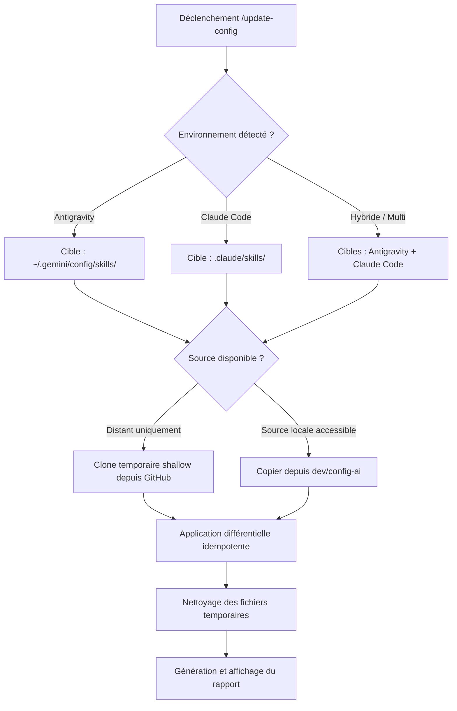

# Compétence : Synchronisation & Mise à Jour des Compétences (Update-Config)

## Description et Objectif
Cette compétence assure la maintenance continue et l'actualisation de l'outillage de l'agent en téléchargeant les dernières compétences publiées sur le dépôt officiel **Config-AI** (`https://github.com/tagcashdev/config-ai.git`).

Contrairement à `init-projet` (réservé au bootstrapping et cadrage initial d'un projet), `update-config` opère de manière ciblée, rapide et **strictement idempotente** :
- Elle vérifie et importe les nouvelles compétences ajoutées sur GitHub (ex: `passation`, `update-config`, etc.).
- Elle met à niveau les compétences déjà installées avec leurs dernières améliorations.
- Elle préserve sans exception les compétences personnalisées ou tierces déjà présentes dans l'environnement.
- Elle ne touche à aucun fichier du projet hôte (`PROJECT_CONTEXT.md`, code source, configurations locales).

---

## Commandes Déclencheuses (Triggers)
Cette compétence s'active via l'un des raccourcis suivants :
- `/update-config`
- `/update-skills`
- `/maj-config`
- Expressions naturelles : *"mets à jour mes compétences"*, *"synchronise config-ai"*, *"récupère les nouveaux skills sur GitHub"*, *"vérifie les mises à jour de skills"*.

---

## Quand utiliser cette compétence
- **Nouvelle compétence publiée** : Lorsqu'une nouvelle compétence a été ajoutée sur le dépôt `config-ai` et que l'utilisateur souhaite en bénéficier immédiatement dans son projet ou son environnement global.
- **Synchronisation périodique** : Pour s'assurer de disposer des dernières versions des scripts, directives et compétences.
- **Migration / Changement de poste** : Pour actualiser rapidement l'ensemble des compétences globales Antigravity ou locales Claude Code sans réinitialiser les fichiers de contexte de projet.

---

## Directives et Bonnes Pratiques

1. **Idempotence Universelle (Règle d'or)** :
   - L'exécution de `update-config` peut être répétée indéfiniment sans risque de régression, d'écrasement intempestif ou de perte de données.
   - Ne **JAMAIS** supprimer ou altérer des compétences qui ne proviennent pas de `config-ai` (compétences personnelles ou installées via `skill-finder`).
2. **Respect de l'Environnement Cible** :
   - **Google Antigravity** : Mise à jour prioritaire dans le répertoire global de l'utilisateur `~/.gemini/config/skills/` (sur Windows : `%USERPROFILE%\.gemini\config\skills`, sur Linux/macOS : `~/.gemini/config/skills`). Si le workspace comporte un dossier `.agents/skills/`, le synchroniser également.
   - **Claude Code** : Mise à jour dans le dossier `.claude/skills/` à la racine du projet actif.
3. **Clonage Temporaire Éphémère** :
   - Récupérer les sources de `config-ai` via un clone superficiel éphémère (`git clone --depth 1`) dans le dossier temporaire du système (`%TEMP%` ou `/tmp`).
   - Nettoyer systématiquement le répertoire temporaire après la synchronisation.
   - Si la source de développement locale (`c:\wamp64\www\dev\config-ai`) est directement présente et demandée, l'utiliser en priorité.
4. **Rapport Différentiel Transparent (Changelog)** :
   - Présenter à l'issue de l'opération un rapport clair catégorisant :
     - 🆕 Les nouvelles compétences installées.
     - 🔄 Les compétences existantes mises à niveau.
     - 🛡️ Les compétences tierces ou locales préservées intactes.

---

## Procédure Pas à Pas / Workflow

1. **Détection de l'Environnement et des Cibles :**
   - Identifier si la session tourne sous Google Antigravity, Claude Code ou les deux.
   - Repérer les dossiers cibles existants (`~/.gemini/config/skills` et/ou `.claude/skills`).

2. **Récupération des Sources de Référence :**
   - Si le dépôt local `c:\wamp64\www\dev\config-ai` est présent sur le poste et accessible, l'utiliser comme source directe.
   - Sinon, cloner silencieusement la dernière version depuis GitHub dans un dossier temporaire :
     ```bash
     git clone --depth 1 https://github.com/tagcashdev/config-ai.git "$TEMP_DIR"
     ```

3. **Exécution de la Synchronisation Idempotente :**
   - Exécuter le script dédié `scripts/sync-config-ai.ps1` (Windows) ou `scripts/sync-config-ai.sh` (Linux/macOS), ou copier directement chaque dossier de `skills/` vers le dossier de destination.
   - Comparer la liste des compétences sources et la liste des compétences cibles.
   - Copier les nouveaux dossiers et écraser/mettre à jour les compétences existantes issues de `config-ai`.

4. **Nettoyage :**
   - Supprimer le dossier temporaire de clone.

5. **Restitution du Bilan :**
   - Afficher le résumé différentiel structuré à l'utilisateur.

---

## Modèles et Exemples

### Format du Rapport Différentiel de Fin d'Exécution

```markdown
### 🔄 Bilan de la synchronisation Config-AI

**Dépôt source :** `https://github.com/tagcashdev/config-ai.git`
**Cible :** `~/.gemini/config/skills/` (Antigravity Global)

| Statut | Compétence | Description |
| :---: | :--- | :--- |
| 🆕 | **passation** | Sauvegarde et reprise fluide de session via passation.md |
| 🆕 | **update-config** | Synchronisation automatique des compétences depuis GitHub |
| 🔄 | **init-projet** | Mise à jour des modèles et directives |
| 🔄 | **verif-code** | Amélioration des critères d'audit |
| 🛡️ | *mon-skill-perso* | Préservé intact (compétence locale) |

✅ Toutes les compétences sont à jour et immédiatement utilisables !
```

---

## Arbre de Décision


